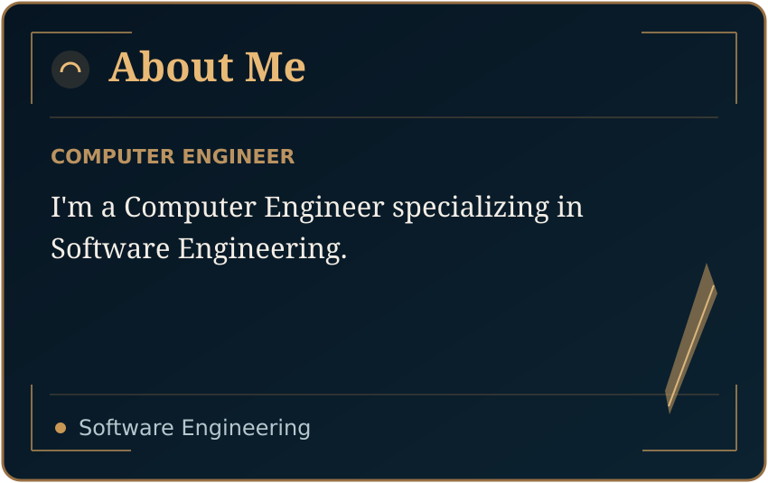
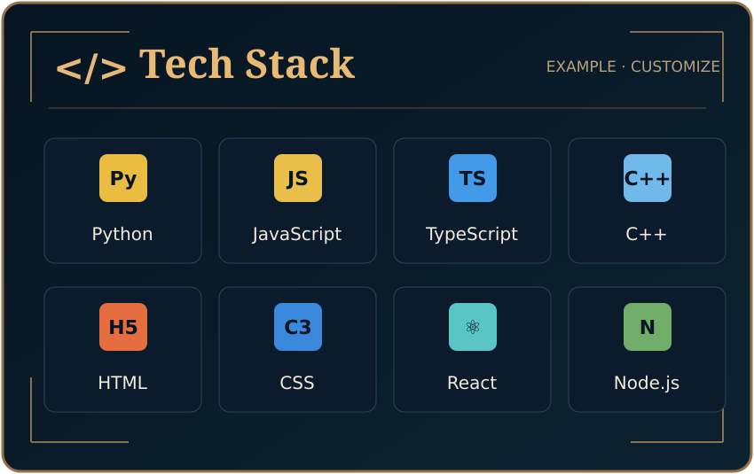
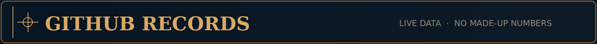
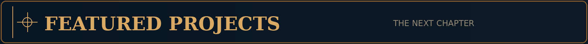
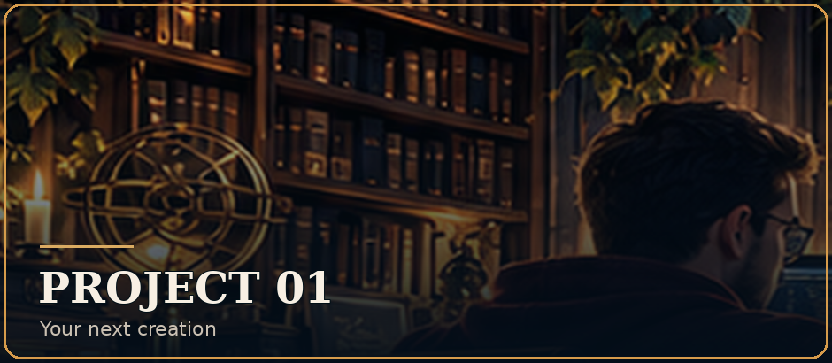
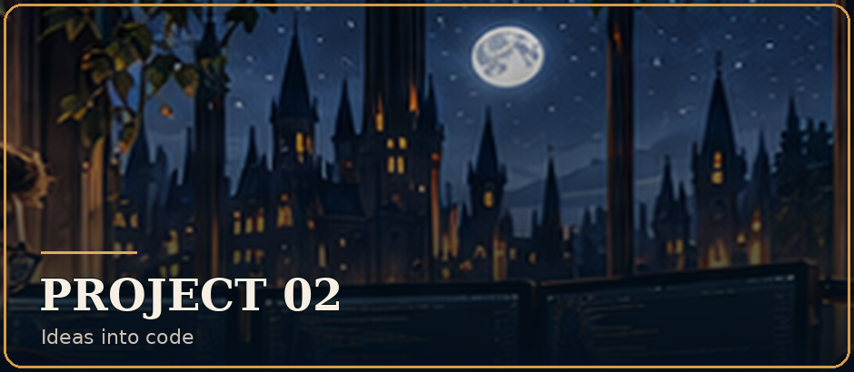
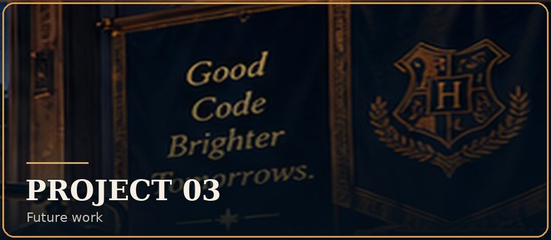

<!-- Midnight Wizard Academia by Hamed Ziarati -->
<!-- Edit profile.json then run: python3 scripts/render_readme.py -->

  
   
  
  <h1>Hi, I'm Hamed Ziarati ✦</h1>
  
<b>I&#x27;m a Computer Engineer specializing in Software Engineering.</b>

  
<i>Good Code. Brighter Tomorrows.</i>

  

    
    
  

  

    
    
  

<!-- Rendered illustration panels are editable through profile.json. -->
<table align="center">
  <tr>
    <td width="50%"></td>
    <td width="50%"></td>
  </tr>
</table>

  
  
   
  

<table align="center">
  <tr>
    <td align="center" valign="top" width="33%">
      
      <b>Project One</b> 
      A place for my next creation. 
      <a href="https://github.com/hamed-ziarati?tab=repositories">Explore →</a>
    </td>
    <td align="center" valign="top" width="33%">
      
      <b>Project Two</b> 
      Ideas waiting to become code. 
      <a href="https://github.com/hamed-ziarati?tab=repositories">Explore →</a>
    </td>
    <td align="center" valign="top" width="33%">
      
      <b>Project Three</b> 
      More work coming soon. 
      <a href="https://github.com/hamed-ziarati?tab=repositories">Explore →</a>
    </td>
  </tr>
</table>

  <a href="https://github.com/hamed-ziarati?tab=repositories">View all repositories →</a>
   
  
  
   
  Thanks for visiting. Keep learning. Keep building. ✦

