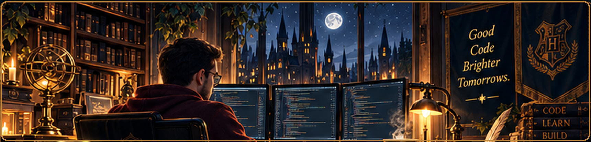
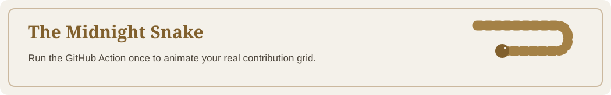

<!-- Midnight Scholar | GitHub profile of Hamed Ziarati -->

  

  <h1>Hamed Ziarati ✦</h1>
  
<strong>Computer Engineer · Software Engineering</strong>

  
<em>Turning ideas into thoughtful code, with a touch of magic.</em>

  

---

### About me

I'm Hamed, a **Computer Engineer specializing in Software Engineering**.

I am currently studying and improving myself in the areas listed below.  
I document and share everything I learn here—aiming to elevate my own craft while supporting anyone walking a similar path.

### Tech stack

<!-- Technologies listed in my developer journey; organized to match the Midnight Scholar palette. -->

**Languages & frameworks**

  
  
  
  
  
  
  

**Data science & machine learning**

  
  
  
  
  
  
  
  
  
  

**Databases**

  
  
  
  

**Developer tools**

  

### GitHub activity

  <a href="https://github.com/hamed-ziarati-dev-journey">
    <picture>
      <source media="(prefers-color-scheme: dark)" srcset="https://github-readme-stats.vercel.app/api?username=hamed-ziarati-dev-journey&amp;show_icons=true&amp;hide_border=true&amp;bg_color=0D1117&amp;title_color=C9A66B&amp;text_color=E6EDF3&amp;icon_color=C9A66B" />
      <source media="(prefers-color-scheme: light)" srcset="https://github-readme-stats.vercel.app/api?username=hamed-ziarati-dev-journey&amp;show_icons=true&amp;hide_border=true&amp;bg_color=FFFFFF&amp;title_color=81602D&amp;text_color=24292F&amp;icon_color=9F793A" />
      
    </picture>
  </a>

### 🐍 The Commit Hunter

  <picture>
    <source media="(prefers-color-scheme: dark)" srcset="assets/github-snake-dark.svg" />
    <source media="(prefers-color-scheme: light)" srcset="assets/github-snake.svg" />
    
  </picture>

<!-- Animated contributions are regenerated automatically by .github/workflows/snake.yml. -->

### ✍️ Random Dev Quote

  <picture>
    <source media="(prefers-color-scheme: dark)" srcset="https://quotes-github-readme.vercel.app/api?type=horizontal&amp;theme=dark&amp;quoteColor=E6EDF3&amp;authorColor=C9A66B&amp;backgroundColor=172433&amp;symbolColor=C9A66B" />
    <source media="(prefers-color-scheme: light)" srcset="https://quotes-github-readme.vercel.app/api?type=horizontal&amp;theme=light&amp;quoteColor=24292F&amp;authorColor=81602D&amp;backgroundColor=FFFFFF&amp;symbolColor=9F793A" />
    
  </picture>

---

  Good code. Quiet ambition. A little magic. ✦

